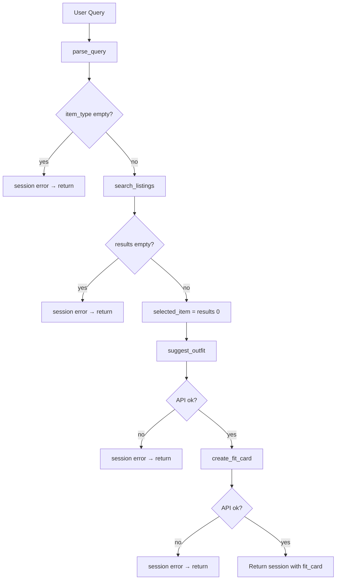

# FitFindr — planning.md

> Spec written before implementation. Updated to reflect the final agent design.

---

## Tools

### Tool 1: search_listings

**What it does:**
Searches the 40 mock secondhand listings in `data/listings.json` and returns items whose title, description, category, and style tags match the user's keywords. Results can be filtered by size and max price, then ranked by relevance score.

**Input parameters:**
- `description` (str): Keywords describing what the user wants (e.g., `"vintage graphic tee"`). Parsed from the natural language query by regex in `utils/query_parsers.py`.
- `size` (str | None): Optional size filter. Case-insensitive substring match (e.g., `"M"` matches `"S/M"`). `None` skips size filtering.
- `max_price` (float | None): Optional maximum price (inclusive). Listings above this price are excluded. `None` skips price filtering.

**What it returns:**
A `list[dict]` of matching listing objects, sorted best-match first. Each dict contains:
`id`, `title`, `description`, `category`, `style_tags` (list[str]), `size`, `condition`, `price` (float), `colors` (list[str]), `brand` (str | null), `platform` (str).

Returns an empty list `[]` when nothing matches. Does not raise an exception.

**What happens if it fails or returns nothing:**
The agent sets `session["error"]` to a specific message naming the search terms and active filters (size, price), then **returns early**. It does **not** call `suggest_outfit` or `create_fit_card`. Example: *"No listings matched your search for 'designer ballgown'. Active filters: size XXS, under $5. Try broadening your search — use fewer filters, raise your price limit, or try different keywords."*

---

### Tool 2: suggest_outfit

**What it does:**
Given the top thrift find and the user's wardrobe, calls Groq (`llama-3.3-70b-versatile`) to suggest 1–2 complete outfit combinations. If the wardrobe is empty, it returns general styling advice instead of naming specific wardrobe pieces.

**Input parameters:**
- `new_item` (dict): A listing dict from `search_listings` — the agent passes `session["selected_item"]` (the top search result).
- `wardrobe` (dict): User wardrobe with an `items` key containing a list of wardrobe item dicts (`id`, `name`, `category`, `colors`, `style_tags`, optional `notes`).

**What it returns:**
A non-empty `str` with outfit suggestions or general styling advice. Never raises for an empty wardrobe.

**What happens if it fails or returns nothing:**
- **Empty wardrobe:** Tool still runs and returns general pairing advice (not an error).
- **Missing API key / invalid key:** Tool raises `ValueError`; agent sets `session["error"]` telling the user to fix `GROQ_API_KEY` and returns early with no fit card.
- **Empty LLM response:** Tool returns a fallback string asking the user to try again.

---

### Tool 3: create_fit_card

**What it does:**
Takes the outfit suggestion string and the selected listing, then calls Groq (`llama-3.3-70b-versatile`, temperature 0.95) to write a 2–4 sentence Instagram/TikTok-style caption mentioning the item title, price, and platform naturally.

**Input parameters:**
- `outfit` (str): The outfit suggestion string from `suggest_outfit` — passed as `session["outfit_suggestion"]`.
- `new_item` (dict): The same listing dict passed to `suggest_outfit` — `session["selected_item"]`.

**What it returns:**
A `str` caption suitable for sharing. If `outfit` is empty or whitespace-only, returns an error message string instead of calling the LLM.

**What happens if it fails or returns nothing:**
- **Empty outfit input:** Returns *"Can't create a fit card without an outfit suggestion. Style the find first, then try generating the fit card again."* — no exception.
- **API failure:** Agent catches the error, sets `session["error"]`, and returns. The outfit suggestion may still be available in the session.

---

### Additional Tools (if any)

None implemented. Stretch feature candidate: retry search with loosened filters when no results are found.

---

## Planning Loop

**How does your agent decide which tool to call next?**

`run_agent()` in `agent.py` uses a **conditional sequential loop** — not a fixed pipeline. Each step checks session state before proceeding:

1. **Parse query** → store in `session["parsed"]`. If `item_type` is empty after parsing, set error and **stop** (no tools called).
2. **Call `search_listings`** with parsed `item_type`, `size`, `max_price`. Store all results in `session["search_results"]`.
3. **Branch on search results:**
   - If `search_results` is empty → set `session["error"]` with filter details and **return immediately**. `suggest_outfit` and `create_fit_card` are **not** called.
   - If results exist → set `session["selected_item"] = search_results[0]` and continue.
4. **Call `suggest_outfit(selected_item, wardrobe)`** → store in `session["outfit_suggestion"]`. On API failure, set error and **stop** (no fit card).
5. **Call `create_fit_card(outfit_suggestion, selected_item)`** → store in `session["fit_card"]`.
6. **Return session.**

The agent is done when either an error is set (early exit) or all three tools have run successfully.

**Key conditional:** Step 3 is the branch that makes behavior adaptive — a no-results query never reaches outfit or fit-card tools.

---

## State Management

**How does information from one tool get passed to the next?**

All state lives in a single **session dict** created by `_new_session()` at the start of each interaction:

| Field | Set when | Used by |
|-------|----------|---------|
| `query` | Session start | Reference / debugging |
| `parsed` | After `parse_query()` | Drives `search_listings` inputs |
| `search_results` | After search | Source for item selection |
| `selected_item` | After search (if results) | Passed to `suggest_outfit` and `create_fit_card` |
| `wardrobe` | Session start | Passed to `suggest_outfit` |
| `outfit_suggestion` | After `suggest_outfit` | Passed to `create_fit_card` |
| `fit_card` | After `create_fit_card` | Final user output |
| `error` | On any early exit | Shown in UI; blocks further tools |

The user never re-enters data between steps. The exact same `selected_item` dict object flows from search → outfit → fit card within one session.

---

## Error Handling

| Tool | Failure mode | Agent response |
|------|-------------|----------------|
| search_listings | No results match the query | Sets `session["error"]` with search terms + active filters + suggestions to broaden search. Returns session with `selected_item`, `outfit_suggestion`, and `fit_card` all `None`. Does not call downstream tools. |
| suggest_outfit | Wardrobe is empty | **Not a failure** — tool returns general styling advice. Agent continues to `create_fit_card`. |
| suggest_outfit | Missing/invalid Groq API key | Sets `session["error"]`: *"Outfit styling failed: Invalid GROQ_API_KEY…"* Returns early; fit card not generated. |
| create_fit_card | Outfit input is missing or incomplete | Tool returns error string internally if outfit is empty. Agent only reaches this tool when outfit exists; API failures set `session["error"]` but outfit text remains in session. |

---

## Architecture

```
User query + wardrobe choice (Gradio app.py)
    │
    ▼
run_agent(query, wardrobe)  ── agent.py
    │
    ├─ parse_query() → session["parsed"]
    │       │
    │       └─ item_type empty? ──► session["error"] → RETURN
    │
    ├─ search_listings(description, size, max_price)  ── tools.py
    │       │
    │       ├─ results = [] ──► session["error"] = helpful message → RETURN
    │       │                     (suggest_outfit & create_fit_card NOT called)
    │       │
    │       └─ results = [item, ...]
    │               │
    │           session["selected_item"] = results[0]
    │               │
    ├─ suggest_outfit(selected_item, wardrobe)  ── tools.py → Groq LLM
    │       │
    │       ├─ API error ──► session["error"] → RETURN
    │       │
    │   session["outfit_suggestion"] = "..."
    │               │
    └─ create_fit_card(outfit_suggestion, selected_item)  ── tools.py → Groq LLM
            │
            ├─ API error ──► session["error"] → RETURN
            │
        session["fit_card"] = "..."
            │
            ▼
        Return session → app.py maps to 3 UI panels
```



---

## AI Tool Plan

**Milestone 3 — Individual tool implementations:**

| Tool | AI input given | Expected output | Verification |
|------|---------------|-----------------|--------------|
| `search_listings` | Tool 1 block above + `load_listings()` signature | Keyword scoring function with price/size filters | Ran `pytest tests/test_tools.py` — 3 search tests pass including empty results and price filter |
| `suggest_outfit` | Tool 2 block + listing/wardrobe field names | Groq LLM call with empty-wardrobe branch | Mocked Groq in test; manually verified empty wardrobe returns string not exception |
| `create_fit_card` | Tool 3 block + caption style guidelines | LLM caption with temperature 0.95 + empty-outfit guard | `test_create_fit_card_empty_outfit` confirms error string, no crash |

**Milestone 4 — Planning loop and state management:**

| Task | AI input given | Expected output | Verification |
|------|---------------|-----------------|--------------|
| Query parsers | Example queries from project brief | Regex extractors for price, size, item description | Tested with `"vintage graphic tee under 30, size M"` |
| `run_agent` | Architecture diagram + Planning Loop + State Management sections | Conditional loop with early return on empty search | `test_agent_no_results_path` confirms fit_card stays None; `agent.py` CLI shows different behavior for happy vs no-results paths |

---

## A Complete Interaction (Step by Step)

**Example user query:** "I'm looking for a vintage graphic tee under $30. I mostly wear baggy jeans and chunky sneakers. What's out there and how would I style it?"

**Step 1 — Parse query**
- `parse_query()` extracts: `item_type="vintage graphic tee"`, `max_price=30.0`, `size=None`, `style_tags=["graphic tee", "vintage"]`
- Stored in `session["parsed"]`

**Step 2 — Search**
- Call: `search_listings("vintage graphic tee", size=None, max_price=30.0)`
- Returns ~3–5 matching listings sorted by keyword score
- Top result example: `"Graphic Tee — 2003 Tour Bootleg Style"` — $24, Depop, size L
- `session["search_results"]` = full list; `session["selected_item"]` = top result dict

**Step 3 — Suggest outfit**
- Call: `suggest_outfit(session["selected_item"], example_wardrobe)`
- LLM receives the band tee listing + 10 wardrobe items (baggy jeans, chunky sneakers, etc.)
- Returns: *"Pair the bootleg tee with your baggy straight-leg jeans and white chunky sneakers. Roll the sleeves once for a relaxed 90s grunge vibe."*
- `session["outfit_suggestion"]` = that string

**Step 4 — Create fit card**
- Call: `create_fit_card(session["outfit_suggestion"], session["selected_item"])`
- Returns: *"scored this faded bootleg tee on depop for $24 and it's giving exactly the grunge energy i wanted 🖤 baggy jeans + chunky sneakers = easy win"*
- `session["fit_card"]` = caption string

**Final output to user:**
Three Gradio panels show:
1. **Top listing** — title, price, platform, size, description
2. **Outfit idea** — wardrobe-based styling suggestion
3. **Fit card** — shareable caption

**Error path (same session, different query):**
Query: `"designer ballgown size XXS under $5"` → search returns `[]` → agent shows error in panel 1 only; panels 2 and 3 stay empty.
